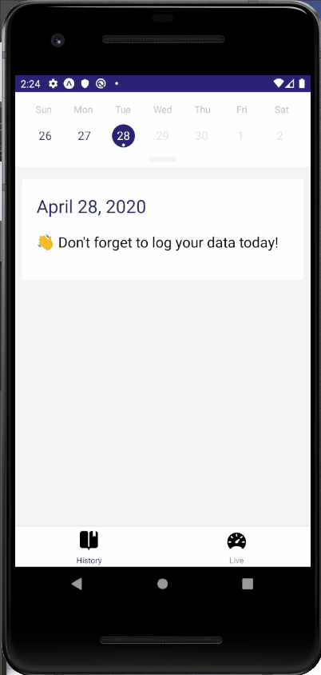

# Udafitness

This project was created by Udacity and is part of the [React Nanodegree program](https://www.udacity.com/course/react-nanodegree--nd019).
This is a React Native app for triathlon where users can record their daily achievements.

Most of the commits in this repository correspond to videos in the program however I decided to implement other features:
- The ability to record metrics for any days not just the current day.

To develop these features I created actions to be dispatched to reducers to update the store as well as asyncronous calls to update the database through redux thank.

## Getting started

### Pre-requisites and Local Development

Developers using this project should already have node and expo installed on their local machines.

## About the stack

### Frontend Server

To run this app, on your terminal, cd to 00_Udafitness :

* install all project dependencies with `expo install`
* start the development server with `expo start`

To view the App in development mode, use the Expo app on your phone and scan the QR code generated or use an Android/Ios Simulator.

### Backend Server

Currently there is no back end server, the app is using AsyncStorage to store data.

## Acknowledgements

I want to thank Udacity for providing the framework and guidelines for this great project.

