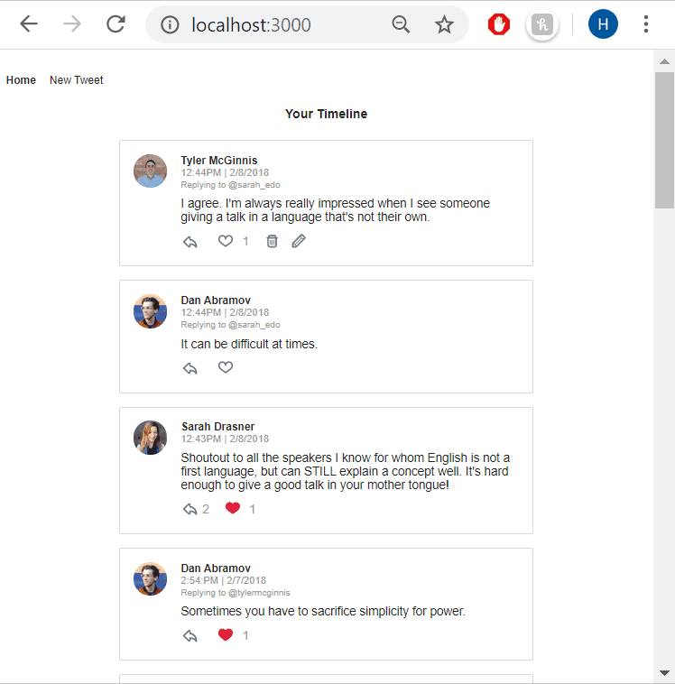

# Chirper Project

This project was created by Udacity and is part of the [React Nanodegree program](https://www.udacity.com/course/react-nanodegree--nd019).
This is a react app where users can post see all the tweets and can also write new tweets, reply to other tweets, and "like" ! 
This react app is using redux to manage the state of the tweets, users, and user authentificated of the application.

Most of the commits in this repository correspond to videos in the program however I decided to implement other features:
- A delete button
- An update button 

To develop these features I created actions to be dispatched to reducers to update the store as well as asyncronous calls to update the database through redux thank.

## Getting started

### Pre-requisites and Local Development

Developers using this project should already have node installed on their local machines.

## About the stack

### Frontend Server

To run this app, on your terminal, cd to 00_reactnd-chirper-app-master :

* install all project dependencies with `npm install`
* start the development server with `npm start`

Open the localhost:3000 to view the App in development mode on the local server.

### Backend Server

Currently there is no back end server, an API has been simulated on src\utils.

## Acknowledgements

I want to thank Udacity for providing the framework and guidelines for this great project.

