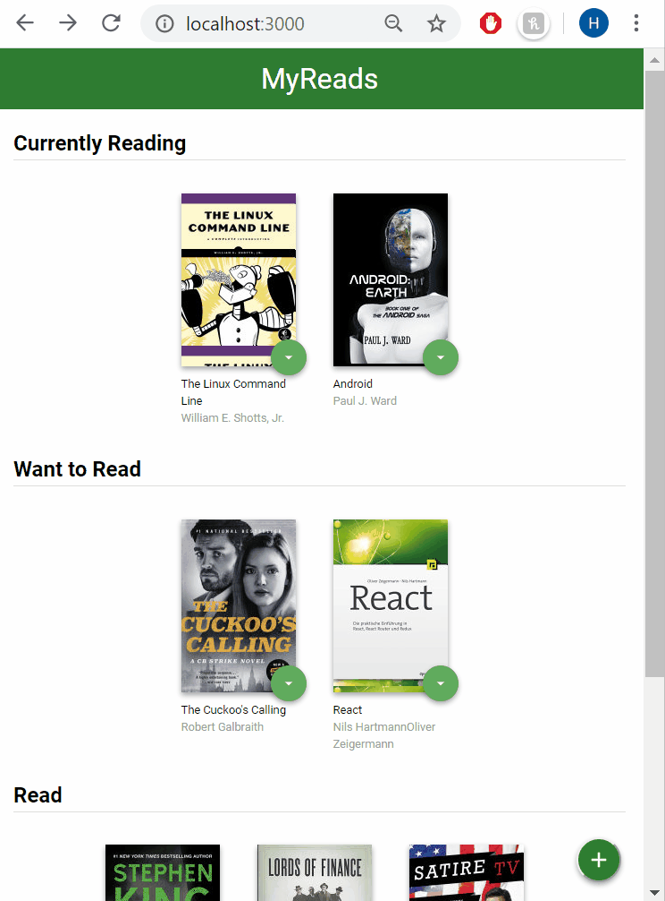

# MyReads Project

This project is part of the Udacity React NanoDegree Program. The goal was to convert a static example of the CSS and HTML markup into a dynamic React App with interactivity. 



## App functionalities

This app allows users to organize their books into 3 categories (shelves): "Currently Reading", "Want to Read" and "Read". The user can search for new books and add or remove books from their shelves.
This app is using react-router-dom for the navigation between pages.

## Getting started

### Pre-requisites and Local Development

Developers using this project should already have node installed on their local machines.

## About the stack

### Frontend Server

To run this app, on your terminal, cd to 01_MyReads :

* install all project dependencies with `npm install`
* start the development server with `npm start`

Open the localhost:3000 to view the App in development mode on the local server.

### Backend Server

The backend server is part of the template package. The provided file [`BooksAPI.js`](src/BooksAPI.js) contains the methods needed to perform necessary operations on the backend:

* [`getAll`](#getall)
* [`update`](#update)
* [`search`](#search)

The application is running on your local machine at http://127.0.0.1:3000/.

#### `getAll`

Method Signature:

```js
getAll()
```

* Returns a Promise which resolves to a JSON object containing a collection of book objects.
* This collection represents the books currently in the bookshelves in your app.

#### `update`

Method Signature:

```js
update(book, shelf)
```

* book: `<Object>` containing at minimum an `id` attribute
* shelf: `<String>` contains one of ["wantToRead", "currentlyReading", "read"]  
* Returns a Promise which resolves to a JSON object containing the response data of the POST request

#### `search`

Method Signature:

```js
search(query)
```

* query: `<String>`
* Returns a Promise which resolves to a JSON object containing a collection of a maximum of 20 book objects.
* These books do not know which shelf they are on. They are raw results only. You'll need to make sure that books have the correct state while on the search page.

## Important
The backend API uses a fixed set of cached search results and is limited to a particular set of search terms, which can be found in [SEARCH_TERMS.md](SEARCH_TERMS.md). That list of terms are the _only_ terms that will work with the backend, so don't be surprised if your searches for Basket Weaving or Bubble Wrap don't come back with any results.

## Create React App

This project was bootstrapped with [Create React App](https://github.com/facebookincubator/create-react-app). You can find more information on how to perform common tasks [here](https://github.com/facebookincubator/create-react-app/blob/master/packages/react-scripts/template/README.md).


## Acknowledgements

I want to thank Udacity for providing the framework and guidelines for this great project.