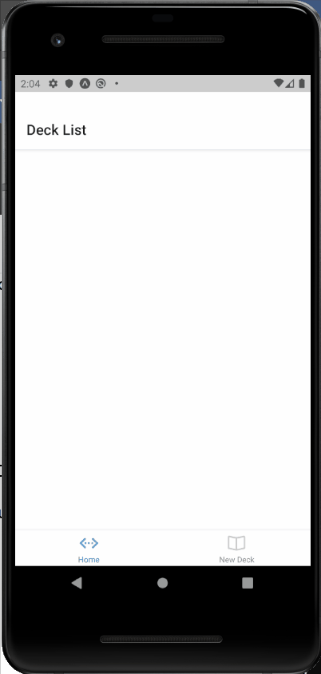

# FlashCards Project

This app also allows users to test their memory on different topics by creating flashcards!
This project is part of the Udacity React NanoDegree Program. The goal of this project is to build a React Native/Redux front-end app from scratch to learn the fundamental aspects of building a native application including and to gain an understanding of AsyncStorage to simulate API calls to database

This project was bootstraped with [Create React App](https://github.com/facebook/create-react-app).



## Platform

Currently this app has only been tested on an Android phone and Android Emulator using the Expo app.

## Functionalities

- Create a deck which can hold an unlimited number of cards.
- Add a card to a specific deck.
- Start a quiz on a specific deck.
- Toggle a button to reveal the answer.
- Select Correct/Incorrect for each question of the quiz.
- Receive the score once the quiz is completed
- Receive a daily notification to remind to study if users haven't already completed a quizz.

## Views

This app has currently 5 views:
- HomeScreen (DeckList View)
- Deck (Individual Deck View)
- Quiz
- New Deck
- New Question

## Animation

Currently when a user click on a deck from the homescreen, the font size will increase and then return back to normal

## Test

The actions and reducers file are tested with Jest
To run test, `yarn jest`

## Data

As there is currently no back end implemented, AsyncStorage is used to store decks and flashcards. 
Here is the format of the data

```
{
  React: {
    title: 'React',
    questions: [
      {
        question: 'What is React?',
        answer: 'A library for managing user interfaces'
      },
      {
        question: 'Where do you make Ajax requests in React?',
        answer: 'The componentDidMount lifecycle event'
      }
    ]
  },
  JavaScript: {
    title: 'JavaScript',
    questions: [
      {
        question: 'What is a closure?',
        answer: 'The combination of a function and the lexical environment within which that function was declared.'
      }
    ]
  }
}
```

## Getting started

### Pre-requisites and Local Development

Developers using this project should already have node installed on their local machines and install [expo](https://docs.expo.io/get-started/installation/?redirected) globally

```
npm install -g expo-cli`
```

## About the stack

### Frontend Server

To run this app, on your terminal, cd to `03_Mobile_Flashcards`:

Install all project dependencies with `expo install` and start the development server with `expo start`.
Use your android device to scan the QR code generated or use your Android Emulator.


### Backend Server

Currently, there is no backend server setup. The `utils/helpers` file regroups the methods to access the data from AsyncStorage.

## Acknowledgements

I want to thank Udacity for providing the framework and guidelines for this great project.
